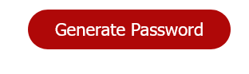
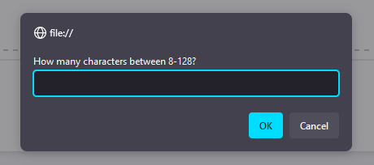
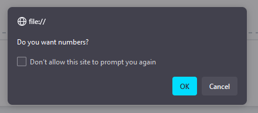
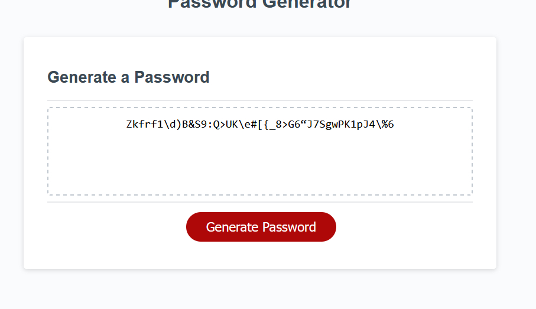
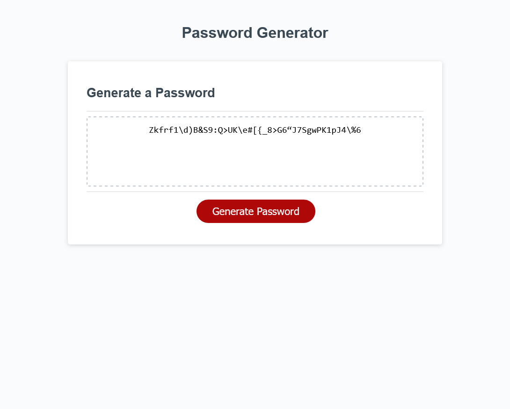

# Password-Generator

## Description
This is a Password-Generator for employees to use. It makes a randomized password between 8-128 characters. It includes different character types (numbers, special characters, uppercase and lowercase) based on the individual.  
## Webpage link
[Password-Generator-Webpage](https://captianbeau.github.io/Password-Gen/)
## Usage
When you visit the webpage click the “Generate Password” button.    
A prompt will appear asking for a number of characters between 8-128, type in the length you want your password to be and click “Ok”.  
 Four more pop-ups will appear, one at a time, asking what character types to include, for Yes press “Ok” for No press “Cancel”.    
 Your password should appear in the text box.
 
## Screenshots

